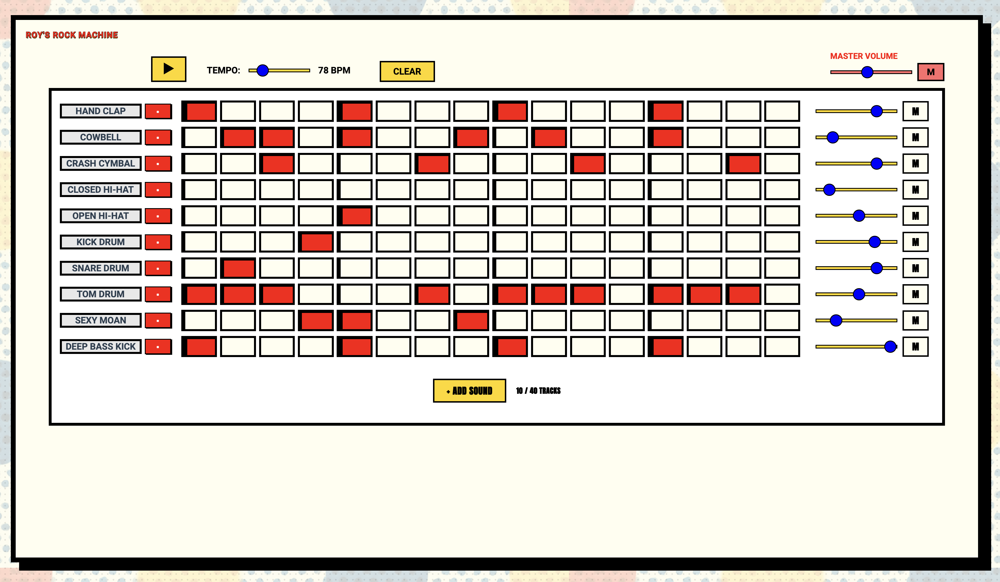

# Roy's Rock Machine

A browser-based drum sequencer with AI-powered sound generation.



## Features

- **Dynamic Drum Sequencer**: Variable-length patterns with real-time editing
- **AI Sound Generation**: Create custom drum sounds using ElevenLabs text-to-speech
- **Sample & Synthesis**: Mix sample-based and synthesized drum sounds
- **Real-time Playback**: Low-latency audio using Tone.js
- **Database-driven**: SQLite backend with migration system

## Setup

### Prerequisites

- Node.js (v18 or higher)
- npm

### Installation

1. Clone the repository
2. Install dependencies:
   ```bash
   npm install
   ```

3. Set up environment variables:
   Create a `.env` file in the root directory:
   ```
   ELEVENLABS_API_KEY=sk_your_api_key_here
   ```
   
   Get your API key from [ElevenLabs](https://elevenlabs.io/app/speech-synthesis/text-to-speech)

4. Start the development server:
   ```bash
   npm run dev
   ```

This will start both the frontend (Vite) and backend (Express) servers concurrently.

## Usage

- **Frontend**: http://localhost:5173
- **Backend API**: http://localhost:3001

### Sound Generation

The app includes AI-powered sound generation using ElevenLabs:

1. Click the "+" button to add a new track
2. Select "Create a New Sound" in the sound selector
3. Enter a text prompt describing the sound you want
4. Adjust duration (0.5-1.5 seconds)
5. Preview and accept the generated sound

## Development

### Testing

```bash
# Run all tests
npm test

# Run tests in watch mode
npm run test:watch

# Generate coverage report
npm run test:coverage
```

### Linting & Formatting

```bash
# Run linter
npm run lint

# Fix linting issues
npm run lint:fix

# Format code
npm run format

# Lint and format together
npm run lint:format
```

## Architecture

- **Frontend**: React + Vite + Tone.js
- **Backend**: Express + SQLite
- **State Management**: Zustand
- **Audio Engine**: Tone.js with Web Audio API
- **AI Integration**: ElevenLabs Sound Generation API

## Database

The app uses SQLite with a migration system. The database is automatically initialized on first run with default sound packs and categories. 